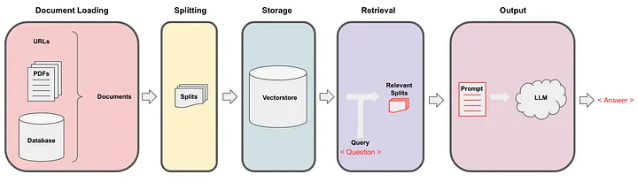
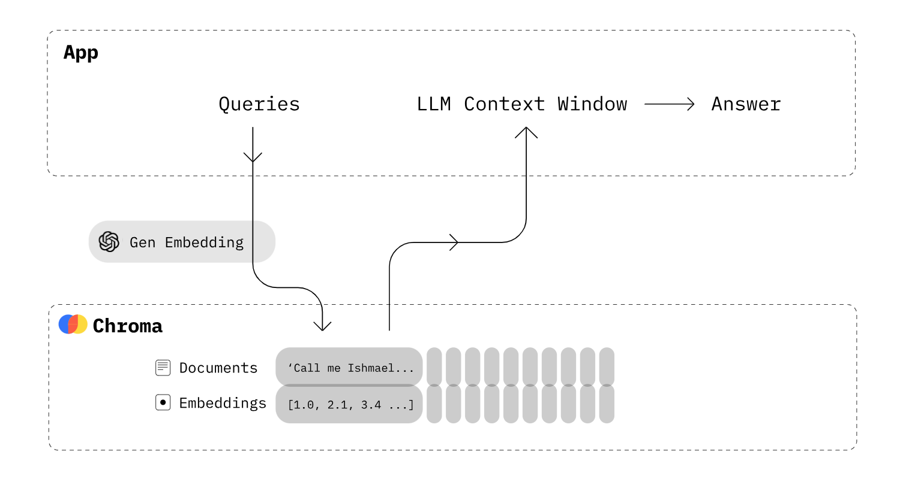

# RAG LangChain Project

This project implements a Retrieval-Augmented Generation (RAG) pipeline using LangChain, FastAPI, and Hugging Face models. It loads documents (PDFs), splits them, stores them in a vector database (Chroma/FAISS), retrieves relevant chunks for a query, and generates answers using an LLM.

## Project Structure

```
rag_langchain/
├── data_source/
│   └── generative_ai/
│       └── download.py
├── src/
│   ├── app.py
│   ├── base/
│   │   └── llm_model.py
│   └── rag/
│       ├── file_loader.py
│       ├── main.py
│       ├── offline_rag.py
│       ├── utils.py
│       └── vectorstore.py
├── requirements.txt
```

- **data_source/generative_ai/download.py**: Script to download sample PDF files for testing.
- **src/app.py**: Main FastAPI app, sets up API endpoints and integrates the RAG pipeline.
- **src/base/llm_model.py**: Loads a Hugging Face LLM pipeline with quantization.
- **src/rag/file_loader.py**: Loads and splits PDF documents in parallel.
- **src/rag/vectorstore.py**: Manages vector database (Chroma/FAISS) and provides retrieval interface.
- **src/rag/offline_rag.py**: Defines the RAG chain and output parsing logic.
- **src/rag/main.py**: Pydantic models for API and function to build the RAG chain.
- **src/rag/utils.py**: Utility for extracting answers from model responses.

## RAG Pipeline Overview

The following diagram illustrates the RAG pipeline implemented in this project:



1. **Document Loading**: Loads PDFs or other documents from URLs or a database.
2. **Splitting**: Documents are split into smaller chunks for efficient retrieval.
3. **Storage**: Chunks are stored in a vector database (Chroma/FAISS) with embeddings.
4. **Retrieval**: Given a user query, relevant chunks are retrieved from the vectorstore.
5. **Output**: Retrieved context is passed to the LLM to generate an answer.

## Vectorstore and Embedding Flow

The following diagram shows how queries and embeddings interact with the vectorstore:



- Documents are embedded and stored in Chroma.
- Queries are embedded and used to retrieve relevant document chunks.
- Retrieved context is sent to the LLM for answer generation.

## Running the Project

1. Install dependencies:
   ```sh
   pip install -r requirements.txt
   ```
2. Download sample PDFs:
   ```sh
   python data_source/generative_ai/download.py
   ```
3. Start the FastAPI server:
   ```sh
   uvicorn src.app:app --host "0.0.0.0" --port 5000 --reload
   ```
4. Access the API at `http://localhost:5000`.

## API Endpoints

- `GET /check`: Health check endpoint.
- `POST /generative_ai`: Submit a question and receive an answer from the RAG pipeline.

## Notes
- You need access to the Hugging Face model specified in `llm_model.py` or change it to a public model.
- The pipeline is modular and can be extended to support other document types or vectorstores.

## Credits
- Built with [LangChain](https://github.com/langchain-ai/langchain), [FastAPI](https://fastapi.tiangolo.com/), and [Hugging Face Transformers](https://huggingface.co/docs/transformers/index).
